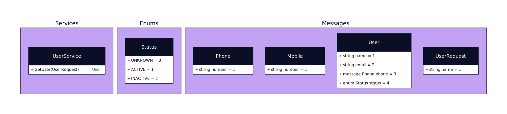

# protoc-gen-d2

[](https://goreportcard.com/report/github.com/mvrilo/protoc-gen-d2)

`protoc-gen-d2` is a plugin for Google's Protocol Buffers (`protoc`) that generates svg of the entities specified in the `proto` files. The idea is to improve a project documentation with a visual representation of the data.

## Example

Given a proto such as:

```proto
syntax="proto3";

package example;

enum Status {
    ACTIVE = 0;
    INACTIVE = 1;
}

message Phone {
    string number = 1;
}

message User {
    string name = 1;
    string email = 2;
    Phone phone = 3;
    Status status = 4;
}

message UserRequest {
    string name = 1;
}

service UserService {
    rpc GetUser (UserRequest) returns (User);
}
```

Run the `protoc` with `protoc-gen-d2`:

```
protoc \
    -I ./testdata/proto \
    --plugin=protoc-gen-d2=./protoc-gen-d2 \
    --d2_out="testdata/generated/" \
    ./testdata/proto/hello.proto
```

Result:

[](https://github.com/mvrilo/protoc-gen-d2/blob/master/testdata/generated/example.svg)

## LICENSE

MIT
